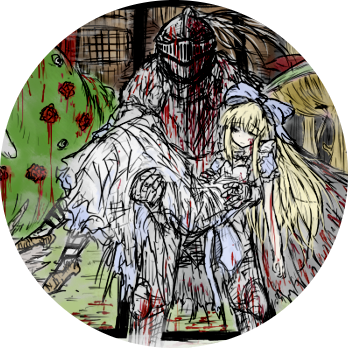

```
           _           _               _ 
 _ __   __| | ___  ___| | ___ __ _ __ | |
| '_ \ / _` |/ _ \/ __| |/ / '__| '_ \| |
| | | | (_| | (_) \__ \   <| |  | | | | |
|_| |_|\__,_|\___/|___/_|\_\_|  |_| |_|_|
                                         
```

你好,
我是钱君哲, 你可以称呼我为钱桑
我喜欢捣鼓自己不懂的东西;
是个笨蛋, 带专生, 垃圾学校, 垃圾专业. 因此, 请多指教.
目前受到的影响, 属于 <font color=#5BCFFA>M</font>t<font color=#F5ABB9>F</font> 群体.

行为准则: 完成该做的目标, 无视娱乐和无用的劳动, 可为此无视身体状态抛弃一切; 发现并及时纠正自己讨厌的品性

> **褐矮星**
> 有意义地活着真是痛苦, 但我还是决定.
> 宁愿在奔波中结束一生, 也不愿窝囊地浪费生命...
> SRS 不是我追求的, HRT 是也不是必要的, 可爱的外貌亦非我本愿.
> 一切缓解措施只是想让自己不要再荒废下去, 我很痛苦, 大家都很痛苦, 要试着去改变这一切.
> 即使这种选择不被周围人认可, 没有华丽的鼓掌, 也要迎接黑暗, 执剑守护在意之人.
> 后人如果能在前人创造的基础上尽力发挥自己的能力, 改善生活水平, 甚至能够对不幸的人施以援手, 那可谓没有遗憾.
> 就是这样, 我要开始去做那些我十分不喜欢但为了理想又永远绕不开的事情了, 希望您能提醒我, 不要忘了这个初衷.
> 提醒一下, 对于钱桑你来说, 好好睡觉也是很重要的事情哦.
> 想要循着大佬的步伐, 去提升自己的能力, 然后跟随自己的心意, 去帮助被抛弃之人.

(但是有可爱的外貌还是挺好的哈哈哈~)

喜欢的音乐:
- XI - Hiroyuki Sawano
- Aiva Op.24 for Piano Four Hands

Feel free to contact me:
- Email: lollipop.studio.cn@gmail.com
- Twitter: [@ndoskrnl](https://twitter.com/ndoskrnl)
- Telegram: [@ndoskrnl](https://t.me/ndoskrnl)
- QQ: 2113952182
- Zhihu: [ndoskrnl](https://www.zhihu.com/people/logarithm-96)

欢迎交换友链~

补个头像?
